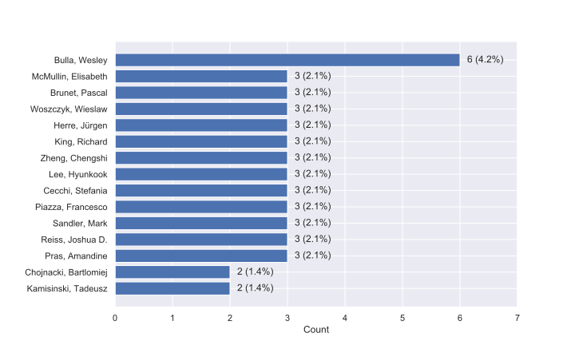
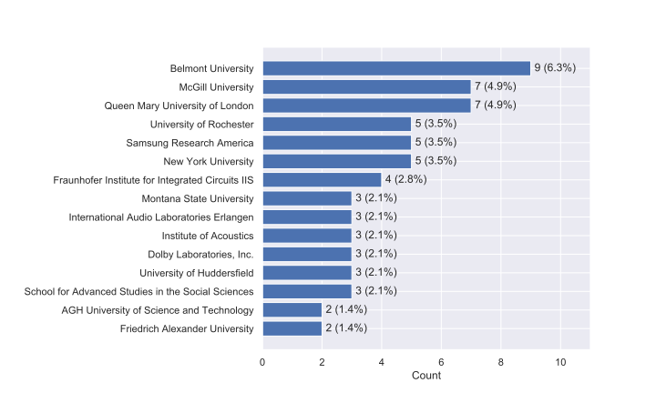
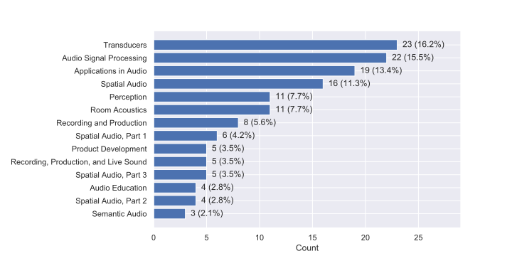
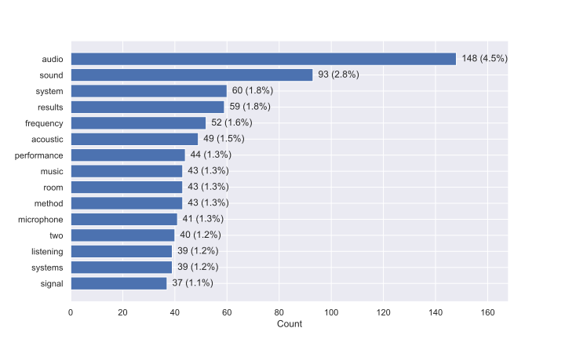

# 147th AES Convention Stats
Analysis of accepted papers at the [147th AES Convention](http://www.aes.org/events/147/) October 16-19th, 2019 - New York, New York, USA

The data for the accepted papers comes from the [convention table of contents page](http://www.aes.org/publications/conventions/?num=147).
This includes full convention papers as well as e-briefs. These will be presented in paper talks or as a poster.
For access to all of the convention papers see [this section of the E-Library](http://www.aes.org/e-lib/online/search.cfm?type=preprint&title=&convnum=147) and for the e-briefs see [this section](http://www.aes.org/e-lib/online/search.cfm?type=ebrief&title=&convnum=147).

## Overall statistics 

Total number of accepted papers: 142 
Total number of affiliations: 132 
Total number of subjects: 14 
Total number of unique abstract words: 3279 

### Top Authors
Number of papers in which each individual is listed an author.

 

### Top Affiliations
Number of papers including each affiliation (an author may have multiple affiliations).

 

### Top Subjects
Total number of papers tagged with one of the provided subjects.

 

### Top Abstract Words
Most commonly occurring words within paper abstracts. 

 
# Disclaimer
These statistics are only estimates. Formatting discrepancies in the scrapped data may skew some of these metrics.